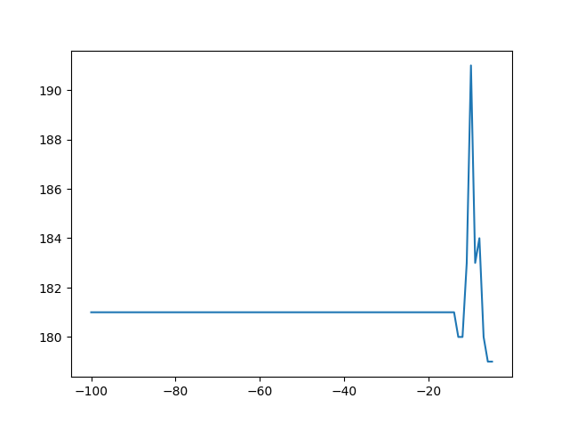

# MRANKA-SKAKATKA-TMAHIND-A2

## Question 1 – Game Theory

### States: 
A state is a state of the board on which we can have various white and black pichus (denoted by ‘w’ or ‘b’), pikachus (denoted by ‘W’ or ‘B’) and raichus (denoted by ‘@’ or ‘$’) or empty spaces (denoted by ‘.’) where a pichu, pikachu or raichu can move.

### Goal State:
The goal state is where we have all white pieces on the board or all black pieces on the board. If we have all white pieces, we are returning a reward equivalent to +infinity and if we have all black pieces on the board, we are returning a reward of -infinity.

### Successor functions:
In the problem set various legal moves related to pichu, pikachu and raichu are given. From a particular state of the board, we consider each of the pieces on the board individually and move them according to their legal moves.

For every successor function for pichu/raichu/pikachu, apart from getting the valid moves for empty spaces, we also took an array of the pieces that could be killed. For example, for a single pichu, the can_kill array would only consist of pichus, while on the other hand, an array of can_kill for raichu will consist of pichus, pikachus and raichus. We keep track of total number of kills possible using a counter variable total_kills using it to prioritize our total moves possible.

### Solution Process and Challenges:

To start with this problem, we assigned certain weights to pichu, pikachu and raichu depending based on their degree of freedom i.e. (pichu:2, pikachu:5 and raichu:8). As a decision function, we have used Minimax algorithm to maximize the reward for white. We assume that the game is played adversarial i.e. the black wants the white to lose.

The challenges we faced was with printing the most optimal move within the given time limit. Our initial attempt was to keep updating the best optimal move after every iteration but this would, on the other hand increase our execution time due to the heavy time complexity of print() function. This conundrum created the tradeoff of ‘Printing the most optimal solution till the current state’ vs ‘Exploring more steps in depth first search fashion’ which may or may not yield a better optimal move.

We calculated the time complexity of print function on a simple O(n^2) loop with a print statement and without a print statement. We observed that the time difference was significant, ranging from 1.7 seconds for the loop with print statement and 0.00065 seconds without the print statement. As a result, it was evident that we could not use print function at every iteration of the depth first search traversal. Hence, we decided to only print the optimal move at each level of our Depth First Search Tree as opposed to all the moves as it explores more nodes given the time.

### Evaluation Function prospects:

This is the most crucial part of the code as we want our evaluation function to be quite accurate but not expensive in terms of time.

For our evaluation function, we assign the weights to the respective pieces which are positive for White moves and negative for the Black moves according to the conventions of our minimax algorithm. To calculate the raichu piece advantage, we calculate the steps required for a white/black pichu and pikachu to be a raichu and updating the score by the total number of steps needed to become a raichu.

Other options were also explored for the evaluation function like checking the total mobility of the pieces, checking the total opponent pieces attacked and checking the total control of the white and black pieces on the board. These tasks seemed costly in terms of time. Hence, I decided to explore the depths and not make the evaluation function expensive as our evaluation function is just an estimate of how good and bad the board is and not the final answer as to how good our board is.

I referred to the following links for intuition on the evaluation function and alpha beta pruning –

chrome-

https://www.naftaliharris.com/blog/chess/ extension://efaidnbmnnnibpcajpcglclefindmkaj/https://www.cmpe.boun.edu.tr/~gungort/undergraduateprojects/Tuning%20of%20Chess%20Evaluation%20Function%20by%20Using%20Genetic%20Algorithms.pdf

I was on the path of pruning the game tree in a smarter way that is I was thinking of finding the most probable pieces to be played and expand the successors for those pieces. The intuition for this is given in the above paper. If I had more time I would have thought on this more and expanded along these lines

## Question 2 – Naïve Bayes Classifier

### Solution Process with Challenges:

Initially I divided the train data into the training set and validation set. The purpose of this is to understand what hyperparameters/data preprocessing to do so that we can get maximum test set accuracy.

To calculate P(class|words) I used naïve bayes law and instead I am calculating P(words|class) * P(class). I also used the independence assumption on P(words|class) that is the probability of occurrence of each word is independent given the class. Although this assumption is not very accurate in the real world it is a small price, we must pay to overcome the true complexity that will arise if we don’t assume independence.

My final classification accuracy on test set currently is 86.50%

Steps followed to achieve this accuracy

### Step 1:

Initially I calculated the probability of occurrence of class_and class_b. This is represented by prob_and prob_b in the code. Then I split the words into a list separated by spaces and calculated the probability of occurrence of each word given the class. This is represented in the form of dict_and dict_b in the code. The validation accuracy at this step was 76.18%

### Step 2:

After Step 1 I removed the punctuation from the data and trained the model again i.e. xI calculated the values of prob_a, prob_b, dict_a and dict_b. This led to an improvement in accuracy from 76.18% to 77%.

### Step 3:

After Step 2 I removed numbers from the strings. The validation accuracy decreased from 77% to 76.50%. This did not make much sense intuitively, that is for ratings/reviews numbers are an important source of information. As the intuition is backed by validation accuracy, I have kept the numbers in the string.

### Step 4:

After Step 3 I took log of probabilities. Because the logarithm is monotonically increasing function of its argument, maximization of the log of a function is equivalent to maximization of the function itself which is what we expect in complex probabilistic models. Taking the log not only simplifies the subsequent mathematical analysis, but it also helps numerically because the product of many small probabilities can easily underflow the numerical precision of the computer, and this is resolved by computing instead the sum of the log probabilities. This improved the validation accuracy from 77% to 80%.

### Step 5:

After Step 4 I removed stop words from my data. While we have libraries to remove all the stop words with NLTK word pool, with the limitation of use of libraries, I declared a static and the most common list of stop words which would operate on the data set. This made a huge improvement in the accuracy from 80% to 84%.

### Step 6:

After this improving the accuracy was hard since we could not use libraries else, we could have used NLTK libraries for lemmatization. I printed out some of the misclassified examples. I could observe many misclassified examples having words in plural form like hotels and hotel. Although in lemmatization using NLTK has a wider range of data formatting such as transforming foot -> feet or troubled- > toubl and many more, nevertheless after confirming our approach with Professor Zoran, I removed the character ‘s’ occurring at the end for all the words which would deal with plurals encountered in the test and train set without the use of python libraries. This can change the semantic of some of the words, but that word will still be a separate word (that is if I remove ‘s’ from enormous the word will become enormu but we can keep the word as enormu as we are essentially working with the frequency of the word). After removing the ‘s’ the validation accuracy improves from 84% to 85%

### Step 7:

As I had printed the misclassified examples, I saw that don’t had become don’t and didn’t have become didn’t. This happened because I had removed punctuations. I could also see a couple of spelling errors. Since we could not use libraries, I hard coded some of the spelling errors and corrected a few spelling errors. I could not make an exhaustive list though, but I tried correcting a few errors manually.

The true_words dictionary encodes this logic. This improved the validation to 85.50%.

Step 8: There can be some instances where a word occurs in the validation data but not in the training data. This would lead to assuming a probability of 0 for that word and as a result we could get a ratio of 0 or a 0/0 division or log (0). Any of these values would lead to a math error. Instead, I take very small probabilities of the order of 10^-10. I tried various log values of probability from this list -> [-100, -50, -20, -17, -16, -15, -14, -13, -12, -11, -10, -9, -8, -7, -6, -5]. Below is the plot for the accuracy for different log probability values.

#### Plot

It is visible from the graph that the max accuracy is when we take the log probability of unseen words as -10.

I then trained the model on the entire dataset using the preprocessing steps given above and tested it on test data. Test accuracy achieved is 87.25%